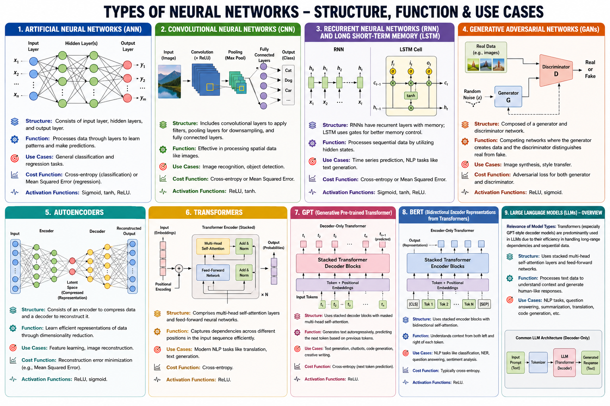
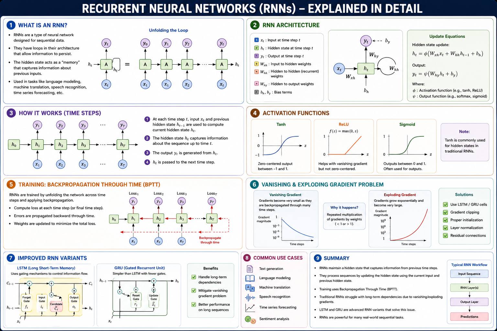
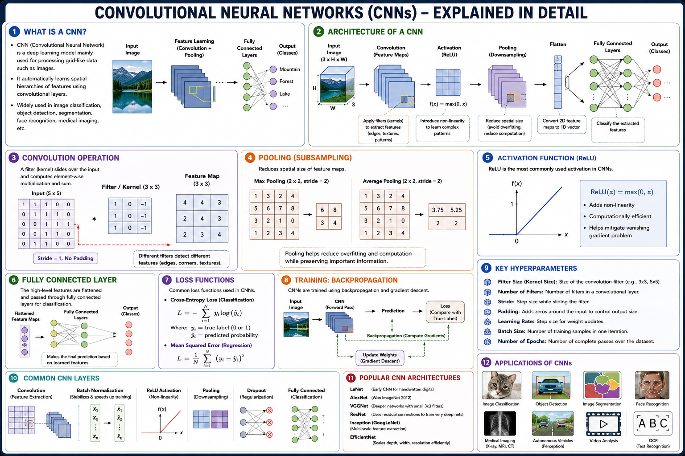
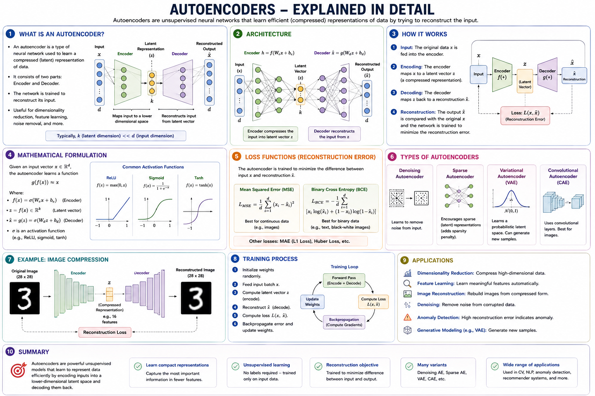
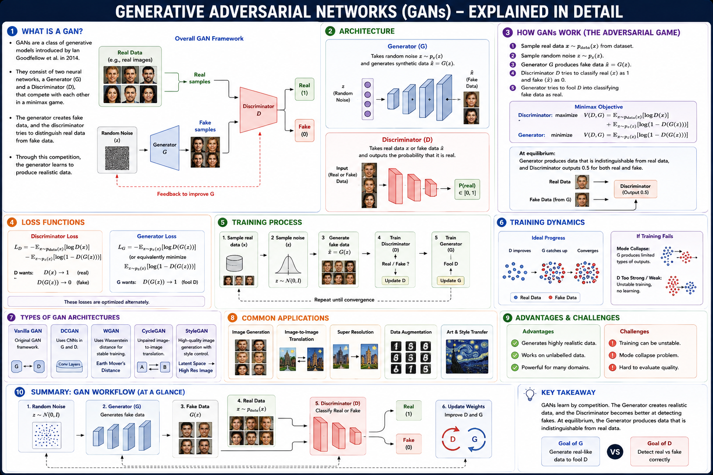
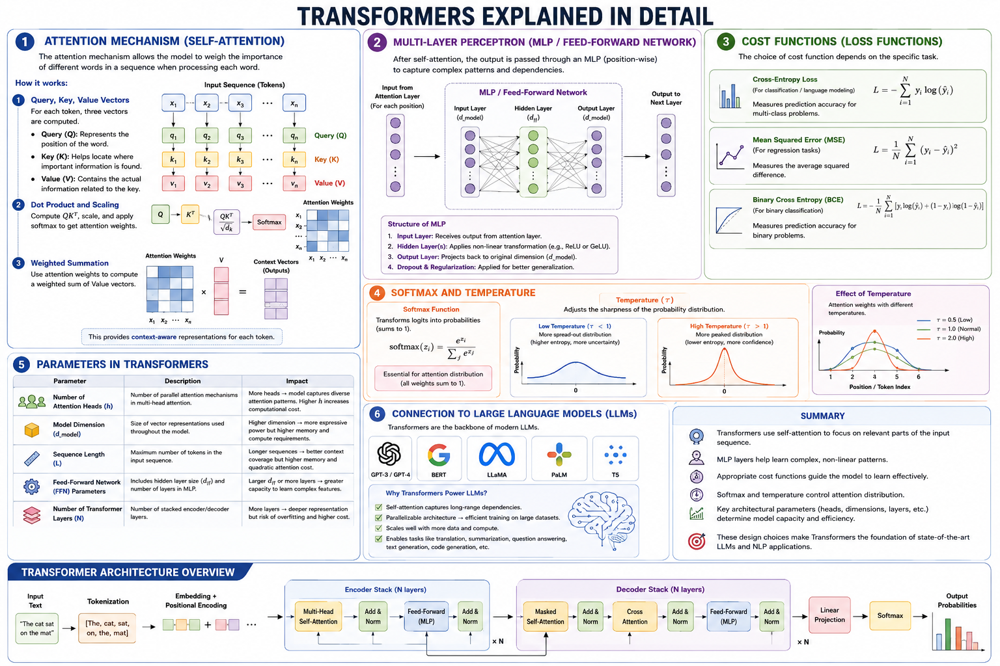

# Deep Learning

### What is Deep Learning?

Deep Learning is a subset of Machine Learning (ML), which itself operates 
under the broader umbrella of Artificial Intelligence. Both aim to develop 
systems capable of performing tasks that typically require human 
intelligence.

### Difference between Deep Learning and Machine Learning

| **Aspect**                        | **Deep Learning**                                                                                                                                                                                      | **Traditional Machine Learning**                                                                                                                                              |
| --------------------------------- | ------------------------------------------------------------------------------------------------------------------------------------------------------------------------------------------------------ | ----------------------------------------------------------------------------------------------------------------------------------------------------------------------------- |
| **Model Complexity**              | Uses deep neural networks with multiple hidden layers to automatically learn complex patterns and representations from data. Suitable for solving highly complex problems.                             | Uses simpler algorithms (e.g., Decision Trees, SVM, Logistic Regression) that work well for structured and less complex problems.                                             |
| **Feature Engineering**           | Automatically learns and extracts features from raw data through multiple neural network layers, eliminating the need for manual feature engineering.                                                  | Requires manual feature engineering, where domain experts select and create relevant features before training the model.                                                      |
| **Choosing the Model**            | Best suited for large datasets, high-dimensional data, and complex tasks such as image recognition, speech recognition, and natural language processing. Requires significant computational resources. | Preferred for smaller datasets, structured data, and simpler prediction or classification tasks. Easier to train, interpret, and deploy with limited computational resources. |
| **Advantage of Feature Learning** | Excels in applications like image recognition by automatically learning features such as edges, textures, shapes, and objects directly from images, resulting in higher accuracy.                      | Relies on manually designed image features (e.g., edges, corners, texture descriptors), which may not capture all relevant information and often require expert knowledge.    |
| **Computational Resources**       | Requires powerful hardware such as GPUs or TPUs, substantial memory, and longer training times due to the large number of model parameters.                                                            | Can typically be trained on standard CPUs with lower memory requirements and shorter training times, making it more resource-efficient.                                       |

### What is a neural network?

A Neural Network (NN) can simply defined as an artificial intelligence 
architecture modeled after biological brains made up of interconnected 
neuron-like nodes that process information by taking inputs through 
multiple layers connected with weights, biases and activation functions 
for performing computational tasks.

In its simplest form it contains one or more input layer(s), hidden 
layer(s) where the computations take place using trained parameters 
(weights/biases), followed by an output layer to generate final 
predictions/classifications. The connection between neurons are 
established through weighted edges which can be adjusted during training 
process based on error gradients computed via backpropagation algorithm.

NNs learn and recognize complex patterns from large datasets in order to 
make accurate predictions, allowing them to handle tasks that even human 
experts struggle with like image recognition or natural language 
processing; making it a powerful tool for solving real-world problems 
across different domains.

### Core Components of Neural Networks

### 1. Neurons / Units

- Each neuron (or node) represents an artificial unit inspired by biological neurons.
  - Receives input signals from other connected units or previous layer(s).
  - Computes weighted sums and applies activation functions to derive outputs, representing the neural processing performed.

### 2. Layers (Input/Hidden Layer / Output)

- Neurons are organized into three types of layers:
  - **Input layer**: The first data-driven layer with features taken from the dataset.
    - Receives input directly after pre-processing
  - **Hidden Layers**: Intermediate processing units which compute weighted sums, activations and other transformations on previous inputs for better feature extraction/reduction. More 
    hidden layers improve neural networks' ability to learn complex patterns (depth).
  - **Output Layer / Classifier/Regulator layer**: Final transformation performed by the network.
    - Produces outputs after several iterations through interconnected neurons in this last stage.

### 3. Connections and Synapses

- Neurons are connected via weighted **synapse** links representing connections between nodes or neuron layers within a neural network structure:
  - Each connection represents an edge with real-valued weights that define its importance.
    - Weight update mechanisms adjust the strength of these synaptic edges to learn complex patterns (weight updating).

### 4. Activation Functions / Transfer functions

- Neural networks require non-linear activation functions for processing and learning from data, adding complexity beyond simple linear combinations:
  - **ReLU/ Rectified Linear Unit**: Non-linearity used in convolutional neural layers.
    - `f(x) = max(0,x)` applies element-wise to the input tensor values.
  - Other activations like Sigmoid/Sine/Chebyshev/Tanh, ReLu derivatives etc.

### 5. Loss Function / Cost function

- Neurons learn how well they perform on tasks by using a metric called loss/loss functions:
  - Measures difference between actual output and predicted results.
    - Common examples: Mean Squared Error (MSE), Cross Entropy/Sum Square error

### What are the different neural networks?

- **Feedforward Neurons/ANN**: These have unidirectional connections between 
  nodes and typically involve layers such as an input layer, hidden layers 
  with activation functions like ReLU/Tanh/Sigmoid etc., followed by the 
  Output Layer.

-  **Recurrent Neural Networks (RNN)** : RNNs are designed to handle 
  sequential data processing tasks where they can remember previous inputs 
  for a given time-step and update their output based on new input values 
  through recurrent connections between neurons present in multiple layers 
  of hidden units/neurons; popular variants include LSTM, GRU etc. They have 
  applications like sequence prediction or text generation.

-  **Convolutional Neural Networks (CNN)** : CNNs are designed to process 
    grid-like structured data such as images where they utilize convolution 
    operations that involve applying filters to the input image which extract 
    features at different levels of abstraction; these extracted feature maps 
    go through pooling and fully connected layers before producing an output 
    classification/classification probabilities for each pixel. Commonly used 
    in tasks like object recognition, face detection etc.

- **Autoencoders** : Autoencoders are a type of unsupervised NN model 
    designed to encode input data into compressed latent space representations 
    or features; subsequently decoding it back into its original form with 
    minimal loss/error using another set of weights/parameters for encoding 
    and decoding layers respectively (usually trained by reconstructing the 
    initial inputs after training). Used in tasks like anomaly detection, 
    dimensionality reduction etc.

- **Generative Adversarial Networks(GANs)** : GAN consists of two neural 
    networks- generator network which generates samples from random noise 
    vectors to make them indistinguishable with real-world data distributions; 
    and discriminator network that tries to differentiate between generated 
    fake/synthetic outputs vs true-real world examples based on learned 
    features or patterns. Trained using backpropagation until both 
    discriminators & generators converge through iterations resulting in 
    realistic synthetic sample generation.

    

- **Transformers**: A transformer is a deep learning model architecture used primarily for processing sequential data (like language) and has been most popularized 
  by the BERT (Bidirectional Encoder Representations from Transformers), 
  GPT-3(Generative Pre-trained Transformer 3), etc., models.  Transformers are designed to efficiently learn complex relationships between words/tokens in sequential data through their unique self-attention mechanism. These capabilities have made them extremely effective for language modeling tasks like translation/sequencing generation as well as other applications involving structured/unstructured inputs such as time-series analysis and image processing etc.. Overall they represent an evolution of neural network models that are capable of learning long-range contextual relationships in data more efficiently than 
   traditional RNN/LSTM networks.

These are some of the popular neural networks used for deep learning 
applications along with many others; choice depends upon 
requirements/specifications, input/output data structures and desired 
performance outcomes to be achieved while building a specific NN model.

### Sample code:

#### ANN:

https://www.kaggle.com/code/prashant111/comprehensive-guide-to-ann-with-keras

#### RNN:

https://www.kaggle.com/code/prashant111/comprehensive-guide-to-rnn-with-keras

#### CNN

https://www.kaggle.com/code/prashant111/comprehensive-guide-to-cnn-with-keras

#### Autoencoders

https://www.kaggle.com/code/residentmario/autoencoders
