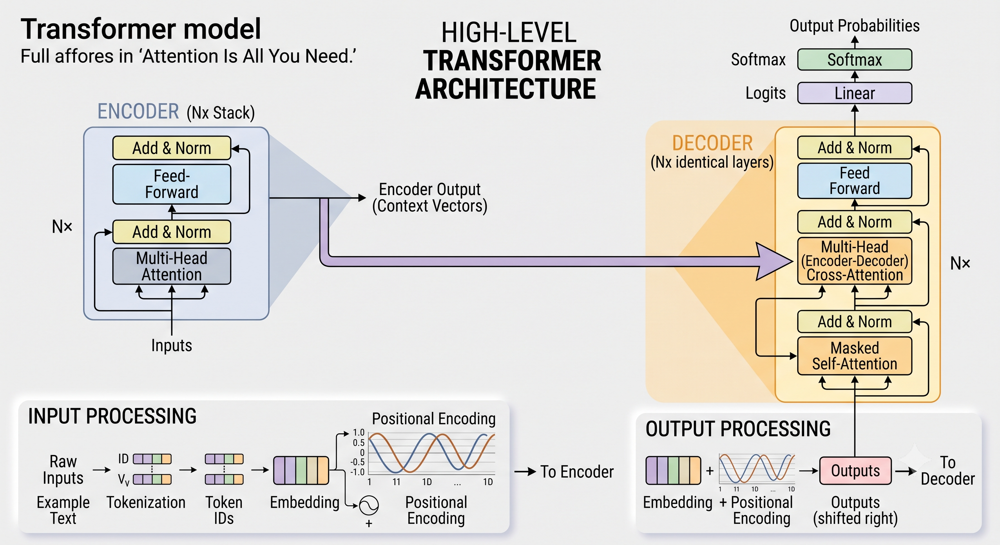
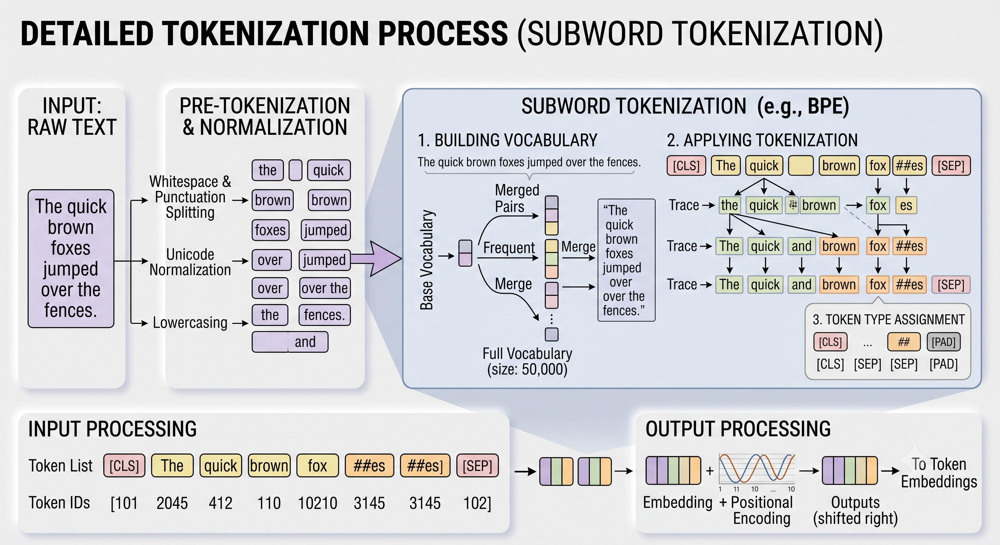
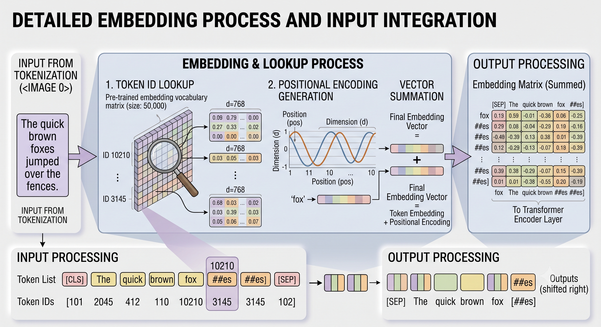
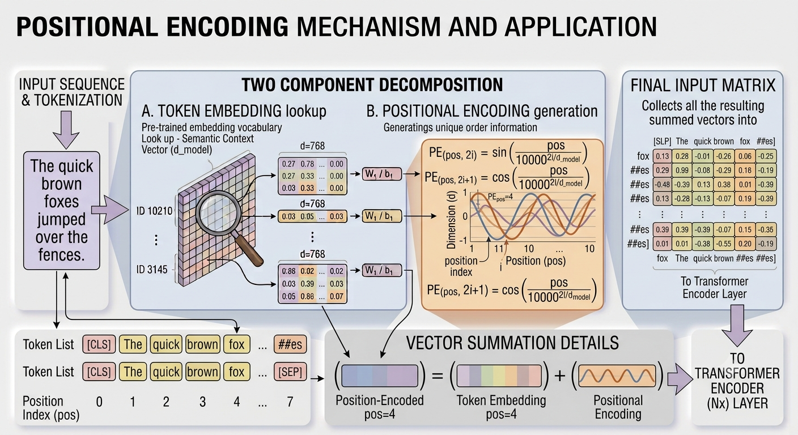
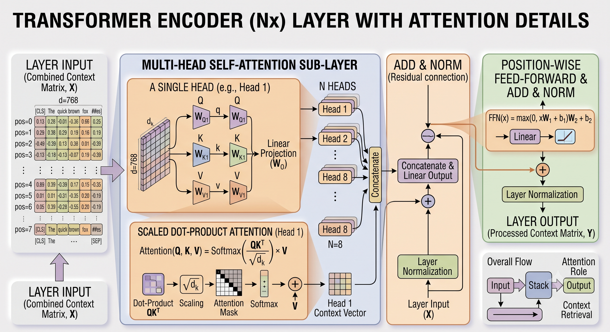
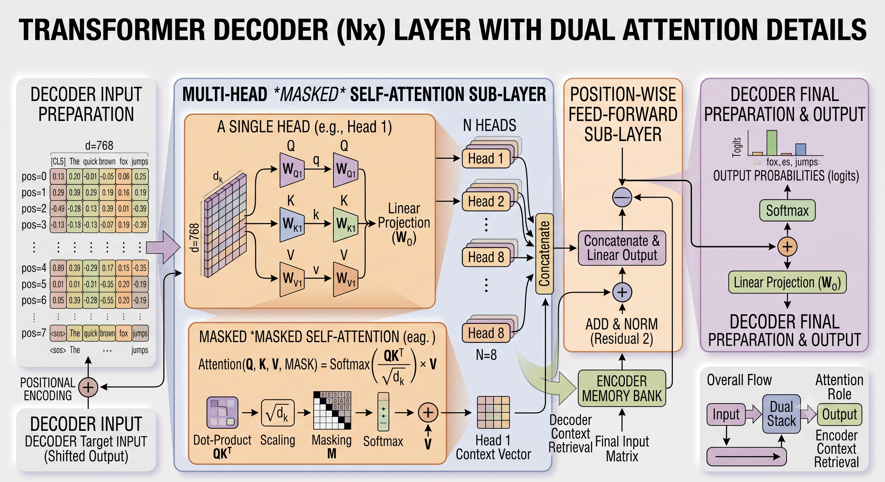

# Transformer

**Transformer** is a type of neural network architecture introduced in the 2017 paper *"Attention Is All You Need"* by Google. It revolutionized natural language processing (NLP) by replacing traditional recurrent neural networks (RNNs) and convolutional networks (CNNs) with a **self-attention mechanism**, enabling parallel processing and better handling of long-range dependencies.

## 1. What can Transformers do?

- [Wav2Vec2](https://huggingface.co/docs/transformers/model_doc/wav2vec2) for audio classification and automatic speech recognition (ASR)
- [Vision Transformer (ViT)](https://huggingface.co/docs/transformers/model_doc/vit) and [ConvNeXT](https://huggingface.co/docs/transformers/model_doc/convnext) for image classification
- [DETR](https://huggingface.co/docs/transformers/model_doc/detr) for object detection
- [Mask2Former](https://huggingface.co/docs/transformers/model_doc/mask2former) for image segmentation
- [GLPN](https://huggingface.co/docs/transformers/model_doc/glpn) for depth estimation
- [BERT](https://huggingface.co/docs/transformers/model_doc/bert) for NLP tasks like text classification, token classification and question answering that use an encoder
- [GPT2](https://huggingface.co/docs/transformers/model_doc/gpt2) for NLP tasks like text generation that use a decoder
- [BART](https://huggingface.co/docs/transformers/model_doc/bart) for NLP tasks like summarization and translation that use an encoder-decoder

## 2. High-Level Macro Architecture Flow

```text
[ INPUT SENTENCE ] 
       |
       v
+-----------------------+
|       ENCODER         |  <-- Processes the whole input at once.
| (Self-Attention Layer |      Creates a "Map of Meaning."
|        x N)          |
+-----------+-----------+
            |
            | (The Map of Meaning / Context Vector)
            |
            v
+-----------------------+
|     CROSS-ATTENTION   |  <-- This is the Bridge.
|    (Encoder to Dec.)  |      The Decoder "looks" at the Encoder's map.
+-----------+-----------+
            |
            v
+-----------------------+
|       DECODER         |  <-- Generates output one word at a time.
| (Self-Attention Layer |      Uses its own previous words + 
|        x N)          |      the information from the bridge.
+-----------+-----------+
            |
            v
[ OUTPUT SENTENCE ]
```

#### Component Roles & Structural Scope

| **Component** | **Role**   | **Analogy**                               | **Key Function**                                                 |
| ------------- | ---------- | ----------------------------------------- | ---------------------------------------------------------------- |
| **Attention** | The Logic  | The Spotlight / High-Tech Sorting Machine | Decides which words are important to the current one.            |
| **Encoder**   | The Reader | The Interpreter / Processing Dept.        | Processes the input and creates a deep understanding of context. |
| **Decoder**   | The Writer | The Storyteller / Packaging Dept.         | Uses the Encoder's info to generate new text word-by-word.       |

#### Architectural Scope

- **Type:** The **Encoder / Decoder** define structural roles (the flow of data from start to finish), whereas **Attention** is a mathematical/logic mechanism defining how a calculation is performed.

- **Dependency:** A Transformer *must* have an Encoder and/or Decoder to function as a Transformer. Attention is a tool used inside those containers (and can be used in non-Transformer architectures as well).

#### Hierarchy View

- **Transformer Architecture** (The whole building)
  
  - Contains the **Encoder** (A large room)
    
    - Uses **Self-Attention** (The specific mechanism inside that room).
  
  - Contains the **Decoder** (Another large room)
    
    - Uses **Self-Attention** AND **Cross-Attention** (The mechanisms inside this room).

**Overview of Architecture**



## 3. Step 1: Tokenization (The "Cutting" Phase)

Think of Tokenization as chopping a sentence into pieces so the computer can handle them one by one.

Instead of looking at a whole sentence like a single block, the model breaks it into **Tokens**. A token can be a whole word, a part of a word (sub-word), or even just a single punctuation mark.

- **Why do we use sub-words?** If the computer only learned whole words, it would struggle with words like "unhappiness." By using sub-words, it can recognize "un", "happy", and "ness" separately. This allows it to understand new words it hasn't seen before by looking at their parts.

### Example Walkthrough

Sentence: `"I love apples."`

1. The computer breaks the sentence into pieces: `["I", " love", " apple", "s"]`

2. Each piece is assigned an ID from a huge dictionary (the Vocabulary):
   
   - `"I"` $\rightarrow$ **101**
   
   - `"love"` $\rightarrow$ **445**
   
   - `"apple"` $\rightarrow$ **892**
   
   - `"s"` $\rightarrow$ **31**



## 4. Step 2: Embedding (The "Meaning" Phase)

Once we have tokens, the computer assigns each token a unique ID (e.g., `"Apple"` = `501`). However, **numbers alone don't carry meaning.** To a computer, the numbers 501 and 502 are just digits; it doesn't know that they both represent fruit.

**Embedding** is the process of turning that ID into a long list of numbers (a vector) that represents the **meaning** of the word. **Embedding is the translation layer between "Words for Humans" and "Math for Computers."**

### Concepts & Characteristics

1. **Coordinates in Meaning Space:** An embedding acts as a "GPS Coordinate" in a massive multidimensional map of meanings. Words with similar meanings are placed close together on this map.

2. **Feature Representation:** Imagine describing a fruit using coordinates like `[Sweetness, Crunchiness, Color Intensity]`:
   
   - **Apple:** `[Sweetness: 8, Crunchy: 9, Redness: 10]`
   
   - **Banana:** `[Sweetness: 9, Crunchy: 2, Yellowness: 10]`
   
    In a Transformer, these dimensions (768+ numbers) represent complex concepts like: *Is it alive? Is it plural? Is it an action/verb? Is it related to technology?*

### Why Embeddings are essential:

- **Captures Similarity:** Token IDs treat "Apple" (101) and "Pear" (102) as distant as "Apple" (101) and "iPhone" (500). Embeddings group similar items close together so the model can generalize.

- **Allows "Relationship Math":** Vector calculations hold true semantically:
  
  $$\text{Vector("King") } - \text{ Vector("Man") } + \text{ Vector("Woman") } \approx \text{ Vector("Queen")}$$

- **Handles Context (Polysemy):** A basic embedding holds the core meaning of "Bank". Self-Attention later shifts its vector based on neighbors ("water" vs "money").

### Visualizing Meaning Space

 

```
[Meaning Space Map]
(High Biological)
^
|      (Apple)  (Banana)  <-- These are close together!
|          *       *
|
|                                (iPhone)
|                                    *
|                                       * (Samsung)
|                                 (Electronic/Tech)
+------------------------------------------------------>
(Low Biological)                                     (High Tech)
```

### Summary Comparison: Tokenization vs. Embedding

| **Feature / Phase** | **Tokenization**                         | **Embedding**                                               |
| ------------------- | ---------------------------------------- | ----------------------------------------------------------- |
| **Analogy**         | Cutting a loaf of bread into slices.     | Giving each slice a "flavor profile" (sweet, salty, etc.).  |
| **Input**           | Raw Text (`"I love apples"`)             | Token IDs (`101, 445, 892`)                                 |
| **Output**          | Token IDs / Chunks                       | Vectors (lists of decimals like `[0.12, -0.5, 0.8...]`)     |
| **Goal / Purpose**  | Break text into manageable index pieces. | Capture the **meaning** and **relationship** between words. |
| **Summary Line**    | Tokenization gives the word a name.      | Embedding gives the word a personality.                     |

## 



## 5. Step 3: Positional Encoding

### The Problem: Transformers see a "Bag of Words"

Before Transformers, Recurrent Neural Networks (RNNs) processed words one by one. Transformers process **the entire sentence at once** to allow GPU parallelization. However, because they see everything simultaneously, they have no natural sense of word order.

Consider these two sentences:

1. *"The dog bit the man."*

2. *"The man bit the dog."*

Without positional awareness, both sentences look identical to the computer because `"dog"`, `"man"`, and `"bit"` have identical coordinates in meaning space.

### The Solution: Positional Encoding

To fix this, we add a "stamp" vector to each embedding to represent sequence position.

- **Embedding of "Dog"** + **Position 1 ("First word")** = Final Input Matrix to Transformer.

- **Embedding of "Man"** + **Position 3 ("Third word")** = Final Input Matrix to Transformer.

These are unique mathematical signatures (using sine and cosine waves) added directly to the input embeddings so the model retains word order.

## 



## 6. Step 4: The Attention Mechanism

### Why Previous Models Failed (RNNs/LSTMs)

- **Vanishing Gradient:** They "forgot" information from the beginning of long sentences.

- **Sequential Processing:** Being strictly sequential, they couldn't be efficiently parallelized on modern GPUs.

### The Attention Spotlight

Attention acts as a dynamic spotlight. When processing a word, Attention allows the model to focus on the most relevant parts of the surrounding text.

- **Example:** In *"The animal didn't cross the street because it was too tired,"* attention links **"it"** specifically to **"animal."**

Plaintext

```
Input Sentence: "The robot sat on the chair."

Word: "Sat" 
       |
       |---> [Attention Weight: 80%] --> "Robot" (Who is sitting?)
       |---> [Attention Weight: 15%] --> "Chair" (Where is it sitting?)
       |---> [Attention Weight: 5%]  --> "The" (Grammar context)

Result: The word "Sat" now contains the "essence" of a robot being on a chair.
```

## 7. Step 5: Queries, Keys, and Values ($Q, K, V$)

To calculate attention, every word is represented by three vectors: **Query ($Q$)**, **Key ($K$)**, and **Value ($V$)**.

### Conceptual Analogies

#### 1. The Database Analogy

- **Query ($Q$):** The search string typed into a search bar (e.g., *"How to bake bread"*).

- **Key ($K$):** The titles and tags of all videos in the database (the indices/labels).

- **Value ($V$):** The actual video content returned.

- *Note:* Unlike traditional database exact matches, Transformers use a "soft search" weighted sum over all values.

#### 2. The Communication Analogy

- **Query ($Q$):** *"What kind of information am I looking for?"*

- **Key ($K$):** *"What kind of information do I contain?"*

- **Value ($V$):** *"If you find my Key relevant to your Query, here is the actual information I will communicate to you."*

### How $Q, K, V$ are Determined & Calculated

1. **Linear Transformations (Creation):**
   
   Given an input matrix $X$, the model passes it through three distinct learned parameter matrices ($W^Q, W^K, W^V$):
   
   $Q = X \times W^Q$
   
   $K = X \times W^K$
   
   $V = X \times W^V$

2. **Dot Product (Similarity):**
   
   Multiply $Q$ by the transpose of $K$ ($Q K^T$) to get raw compatibility scores between words.

3. **Scaling:**
   
   Divide dot products by $\sqrt{d_k}$ (the square root of the key dimension). This prevents massive numbers that cause vanishing gradients in Softmax.

4. **Softmax:**
   
   Applies Softmax to convert scores into probabilities ($0$ to $1$) summing to $1.0$.

5. **The Weighted Sum:**
   
   Multiply Softmax probabilities by $V$. Irrelevant terms drop near zero; relevant terms pass their information forward.

$$
\text{Attention}(Q, K, V) = \text{softmax}\left(\frac{QK^T}{\sqrt{d_k}}\right)V
$$

### Multi-Head Attention

Instead of running a single attention calculation, the Transformer runs multiple "heads" in parallel.

- One head might focus on grammar relationships.

- Another head might focus on subject/verb connections.

- Another head might focus on verb tense.

## 8. Step 6: Encoder vs. Decoder Execution Block

```
       Encoder Block (Nx)                         Decoder Block (Nx)
 +----------------------------+             +----------------------------+
 |    Multi-Head Attention    |             | Masked Multi-Head Attention|
 +--------------+-------------+             +--------------+-------------+
                |                                          |
                v                                          v
 +----------------------------+             +----------------------------+
 |     Feed-Forward Network   |             |  Cross-Attention (Enc-Dec) |
 +----------------------------+             +--------------+-------------+
                                                           |
                                                           v
                                            +----------------------------+
                                            |     Feed-Forward Network   |
                                            +----------------------------+
```

### Detailed Structural Comparison

| **Feature**                   | **Transformer ENCODER (N×)**                                                  | **Transformer DECODER (N×)**                                                                                                   |
| ----------------------------- | ----------------------------------------------------------------------------- | ------------------------------------------------------------------------------------------------------------------------------ |
| **Primary Goal**              | **Analyze** input sequence and build a context-aware memory bank.             | **Generate** output sequence, token-by-token, using encoder memory.                                                            |
| **Input Content**             | Complete input text simultaneously (e.g., full source sentence).              | Partial output sequence generated *so far* (autoregressive).                                                                   |
| **Sub-layers per Block**      | **2 Sub-layers:**<br>1. Self-Attention<br>2. Feed-Forward                     | **3 Sub-layers:**<br>1. Masked Self-Attention<br>2. Cross (Encoder-Decoder) Attention<br>3. Feed-Forward                       |
| **Attention Types**           | **Standard Self-Attention:** Attends across all tokens in the input sequence. | **1. Masked Self-Attention:** Masks future tokens.<br>**2. Cross-Attention:** Queries Encoder's memory bank.                   |
| **Where $Q, K, V$ Come From** | $Q, K, V$ are **all** derived from the same source (previous encoder layer).  | **Masked Self-Attn:** $Q, K, V$ from previous decoder output.<br>**Cross-Attn:** $Q$ from Decoder; $K, V$ from Encoder output. |
| **Key Output**                | Contextualized representation matrix (memory bank).                           | Next-token probabilities (logits) to predict next word.                                                                        |

#### Self attention vs Multihead attention

In sentence **"Mary gave roses to Susan"** to see how both mechanisms process the exact same input.

**Using a Single Self-Attention Mechanism:** The model computes one set of Query, Key, and Value matrices for the entire sentence. When it processes the word "gave", the attention mechanism calculates that this verb is highly relevant to "Mary" (the person doing the giving), "roses" (the item being given), and "Susan" (the recipient).

However, because there is only one attention operation, **all of this information is summed and averaged together into a single vector**. The model knows that "gave" is strongly connected to Mary, roses, and Susan, but it cannot clearly distinguish the different *roles* each word plays because those distinct relationships are blended into one mixed signal.

**Using Multi-Head Attention:** Instead of computing attention once, the model splits the word embeddings into smaller segments and runs several self-attention operations (called "heads") in parallel. Because each head has its own independent weight matrices, it can learn to **focus on entirely different aspects of the same word** simultaneously.

Given the exact same input, the heads can specialize to give the model greater discriminatory power:

- **Head 1** might act as the "subject finder," forming a strong relationship between "gave" and **"Mary"**.
- **Head 2** might act as the "object finder," forming a strong relationship between "gave" and **"roses"**.
- **Head 3** might act as the "recipient finder," linking "gave" heavily to **"Susan"**.
- **Head 4** might simply focus on grammar, recognizing that "gave" is acting as a verb in this specific context.

**The Key Difference:** A single self-attention mechanism forces the model to mash all contextual relationships into one averaged perspective. Multi-head attention splits the workload, allowing the model to **maintain multiple, distinct perspectives of how words relate to one another** at the exact same time.

**Encoder**



**Decoder**



## 9. After all the Attention

**1. Residual Connection (Add)** Immediately after the attention layer, the model uses a "skip" or residual connection. It takes the original input vector (from before the attention layer) and adds it directly to the output of the attention layer. This acts as a structural highway that helps prevent the vanishing gradient problem, allowing gradients to flow easily backwards through the network so it can train very deep layer stacks effectively.

**2. Layer Normalization (Norm)** The summed result is then passed through Layer Normalization. This step acts as a "tidy-up crew," independently normalizing the values of each individual token's vector so they have a mean of 0 and a standard deviation of 1. Keeping these values centered and bounded stabilizes the training process and prevents the numbers from growing wildly out of control.

**3. Encoder-Decoder Cross-Attention (Only in the Decoder)** If the data is moving through the Decoder block, the first attention mechanism it hits is *Masked Self-Attention*. After the Add & Norm steps for that layer, it must pass through an **Encoder-Decoder Cross-Attention** layer. In this step, the decoder uses its current state as the *Queries* to search through the *Keys* and *Values* provided by the final output of the Encoder. This allows the decoder to pull relevant information from the original input prompt. This is followed by another round of Add & Norm.

**4. Position-wise Feed-Forward Network (FFN)** Next, the normalized data is passed into a Feed-Forward Network. Unlike the attention mechanism, which mixes information across different words, the FFN acts on each token **independently and identically**. It consists of a small, two-layer neural network that:

- **Expands** the token's dimensionality (e.g., from 512 up to 2048).
- Applies a **ReLU activation function** to introduce non-linearity and zero out negative values.
- **Shrinks** the vector back down to its original dimension. This phase acts as "private thinking time" for the network, giving each token the independent capacity to process, remix, and specialize based on the context it just gathered from the attention phase.

**5. Second Add & Norm** Just like with the attention mechanism, the output of the Feed-Forward Network is bypassed by another residual connection and sent through one last Layer Normalization step to ensure the data remains stable before moving to the next block.

**6. Linear Layer and Softmax (Final Output Generation)** Once the token has traveled through the entire stack of encoder and decoder blocks, it needs to be converted into an actual word prediction.

- It first passes through a final **Linear Layer** (or fully connected layer), which projects the vector into a massive list of raw scores—one for every single token in the model's vocabulary.
- Finally, these raw scores are passed through a **Softmax function**. The Softmax converts the scores into probabilities (between 0 and 1) that sum to exactly 1.0. The model then selects the word with the highest probability as its generated output
